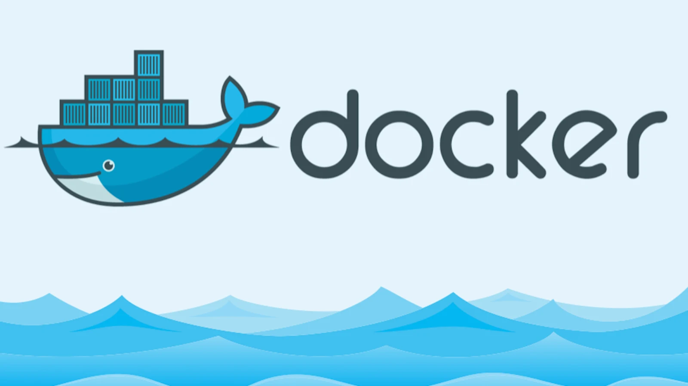

# CONFIGURACIÓN DOCKER-SQL

## PASOS A SEGUIR DOCKER
 1. DESCARGA EN LOCAL EL ARCHIVO DOCKER-COMPOSE
 2. EJECUTA `docker-compose up -d` DENTRO DE LA TERMINAL, USANDO LA UBICACIÓN DE LA CARPETA
 3. ABRE LA URL `http://localhost:5050`
 4. INGRESA CON LAS CREDENCIALES
    - user: admin@admin.com
    - password: admin

DE MOMENTO NO HAY MÁS

VIDEO TUTORIAL:
URL: https://www.youtube.com/watch?v=uKlRp6CqpDg&t=675s&ab_channel=FaztCode
