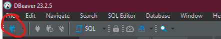
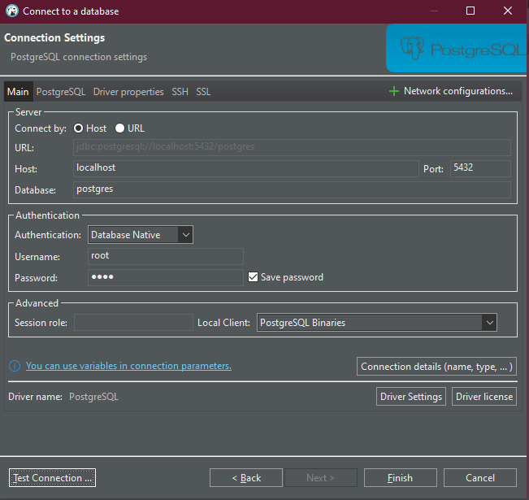
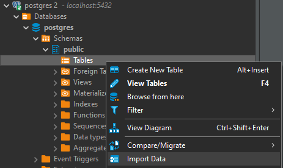

# USO DBEAVER

Mirad el tutorial de docker_config_sql primero

## UNA VEZ EL COMPOSE Y LOS CONTENEDORES ESTÁN ENCENDIDOS
1. Pulsáis aquí y le dais a Postgres
 

2. Rellenáis de la siguiente forma (la contraseña es root también):

3. En DBeaver solo se pueden importar .csv o similares, para trabajar con el dato en sí usar pgadmin.

4. En DBeaver se pueden crear tablas a partir del script .sql hecho (TODO LO QUE SE HAGA TIENE QUE ESTAR DENTRO DEL SCRIPT .sql para pepo)