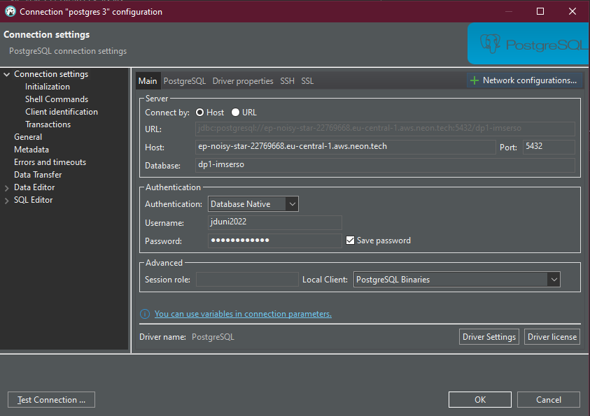

# BASE DE DATOS COMÚN EN REMOTO

He creado una base de datos en remoto, esta es la misma para todos. De esta forma no es necesario estar escribiendo siempre el código .sql para actualizar la base de datos. Aún así los cambios que queden recogidos en el .sql

Podéis seguir usando la base de datos en local, mientras actualicéis siempre el código .sql.

### PARA CONECTARSE MEDIANTE DBEAVER:
- Host: ep-noisy-star-22769668.eu-central-1.aws.neon.tech
- Port: 5432
- Database: dp1-imserso
- Username: jduni2022
- Password: BA5ERITi7cqL

