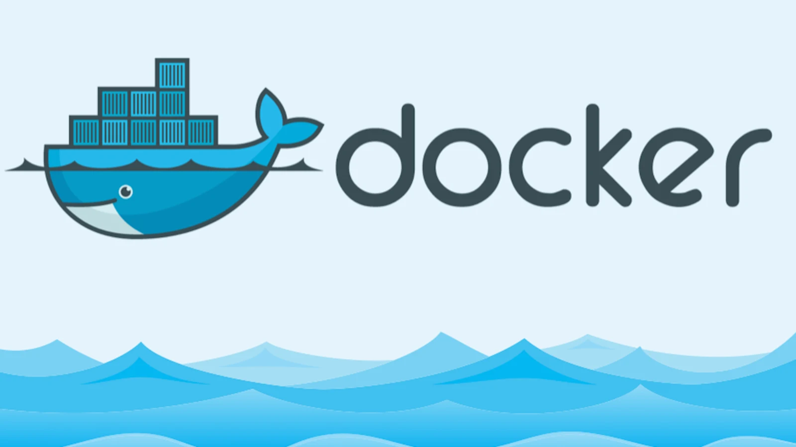
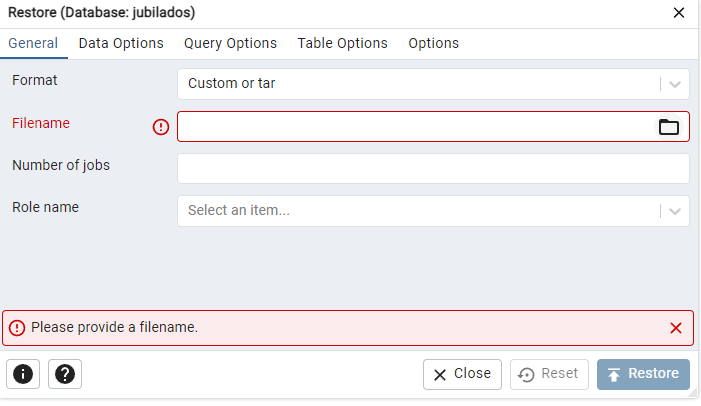
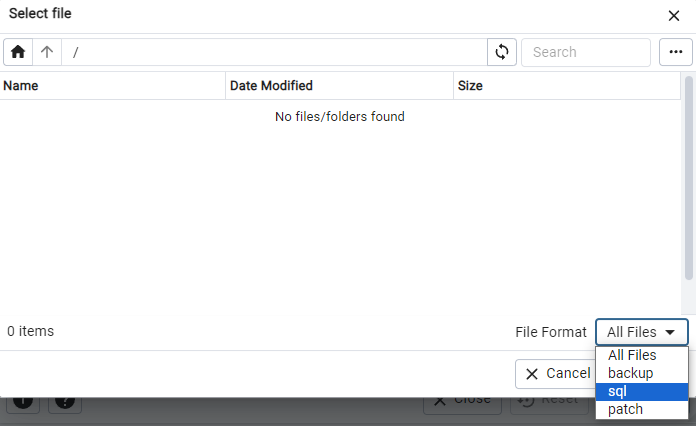
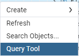
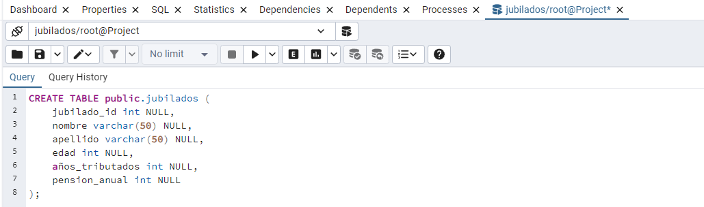

# CONFIGURACIÓN DOCKER-SQL

## PASOS A SEGUIR DOCKER
 1. DESCARGA EN LOCAL EL ARCHIVO DOCKER-COMPOSE
 2. EJECUTA `docker-compose up -d` DENTRO DE LA TERMINAL, USANDO LA UBICACIÓN DE LA CARPETA

  UNA VEZ ENCENDIDO EL CONTAINER, PODÉIS USAR O DBEAVER VIENDO EL OTRO TUTORIAL O PGADMIN, LO SIGUIENTE ES TODO PARA PGADMIN.
  
 3. ABRE LA URL `http://localhost:5050`
 4. INGRESA CON LAS CREDENCIALES
    - user: admin@admin.com
    - password: admin

DE MOMENTO NO HAY MÁS

VIDEO TUTORIAL:
URL: https://www.youtube.com/watch?v=uKlRp6CqpDg&t=675s&ab_channel=FaztCode

## UNA VEZ EN PGADMIN U OTRAS

### PARA GUARDAR BASE DE DATOS EN LOCAL
- PASO 1
  

Lo de Jubilados no saldrá, darle encima de Databases y luego 'Restore'
- PASO 2
  

Le dais a la carpeta de la derecha de Filename
- PASO 3
  

Buscáis la ruta donde está el archivo .sql, cambiad el fileformat de bajo a la derecha

- PASO 4

Trabajar, TODO LO QUE SE HAGA TIENE QUE ESTAR DENTRO DEL SCRIPT .sql para pepo

- PARA ABRIR UN SCRIPT
  
  

Click derecho sobre en panel de la izquierda y escribís código .sql, por ejemplo:

PARA IMPORTAR DESDE UN CSV MIRAD EL VIDEO: https://www.youtube.com/watch?v=Ikd2xSb00UI&ab_channel=BhaskarReddyPulsani
