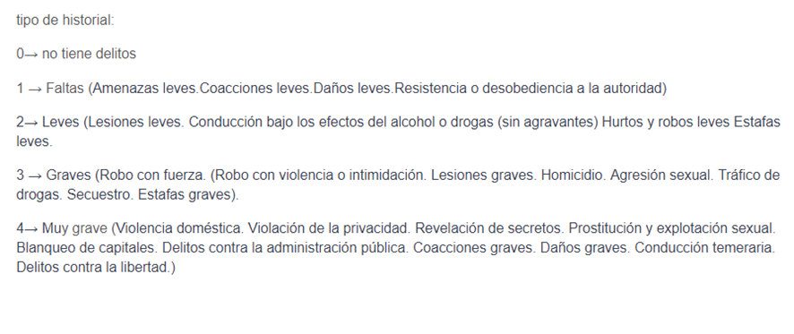

# ORIGEN DE LOS DATOS

## TABLA JUBILADOS

### Edad:
Para obtener información relacionada con la edad de los jubilados, hemos examinado la distribución de edades en la población real, asignando un peso equivalente a estas edades en nuestro grupo de jubilados.
Fuente: https://datosmacro.expansion.com/demografia/estructura-poblacion/espana

### Historial:
Para analizar los porcentajes de individuos que cometen delitos y el tipo de delito, hemos compilado una lista que incluye los delitos asociados con cada categoría.

Posteriormente, utilizando datos específicos para cada tipo de delito, hemos calculado los porcentajes correspondientes.
Fuente: https://www.ine.es/jaxiT3/Datos.htm?t=25997

### Hijos:
Para calcular el número de hijos en cada familia de jubilados, hemos consultado datos reales proporcionados por el Instituto Nacional de Estadística (INE). Hemos considerado los datos de las personas mayores de 50 años.
Fuente: https://www.ine.es/jaxi/Datos.htm?path=/t20/p317/a2018/def/p01/e01/l0/&file=01001.px

### Fumador: 
Para identificar a los fumadores, hemos accedido a los datos proporcionados por el Instituto Nacional de Estadística (INE) y calculado el porcentaje de personas mayores de 58 años que son fumadores.
Fuente:  https://www.ine.es/jaxi/Datos.htm?path=/t00/mujeres_hombres/tablas_1/l0/&file=d07001.px

### Pensionistas por comunidad:
Para determinar la cantidad de pensionistas que habrá en cada comunidad, hemos empleado datos reales que reflejan la distribución en la tabla de jubilados.
Fuente: https://www.seg-social.es/wps/wcm/connect/wss/a59fc4a1-faa7-48dd-9a0e-a20302891ae3/PTAS202311.pdf?MOD=AJPERES&CONVERT_TO=linktext&CACHEID=ROOTWORKSPACE.Z18_2G50H38209D640QTQ57OVB2000-a59fc4a1-faa7-48dd-9a0e-a20302891ae3-oMvfwOj

### Pensionistas que no residen en España:
Para completar el lugar de residencia de los jubilados necesitamos saber también el porcentaje de miembros que no residen en España 
Fuente: https://www.ine.es/prensa/pere_2023.pd

### Estado civil:
### Pensión anual:
### Discapacidad:
### Enfermedades:
### Propiedades:
https://www.bankinter.com/blog/finanzas-personales/propietarios-mas-dos-viviendas
### Endeudamiento:
### Participación en un voluntariado:
https://plataformavoluntariado.org/el-voluntariado-alcanza-una-cifra-record-en-2022/

